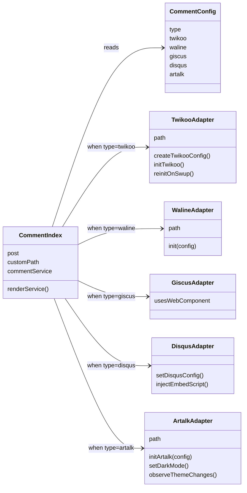
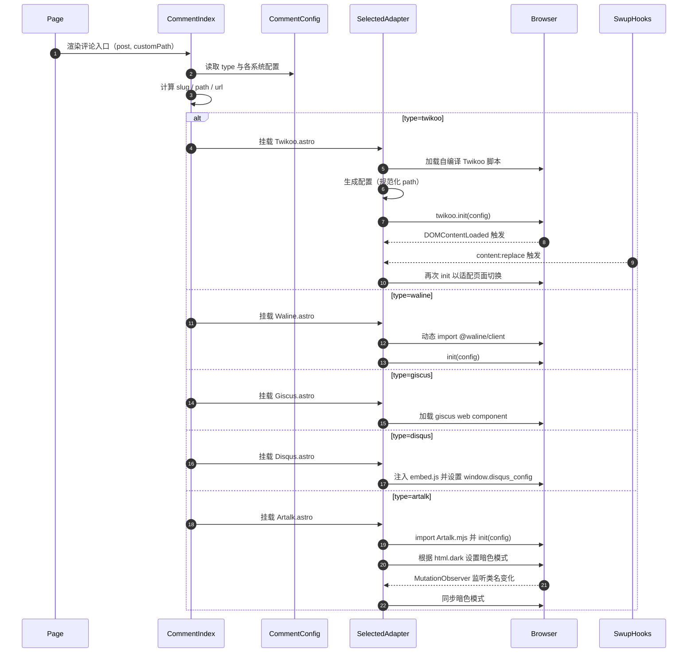

# 评论系统架构总结（类图 + 时序图）

> 目标：帮助理解评论区的核心实现、组件职责划分、配置与生命周期，便于后续维护与扩展。

## 代码结构总览
- 入口与编排：
  - [index.astro](file:///e:/MyGithubPro/Gxy_BLog/src/components/comment/index.astro) 根据 [commentConfig.ts](file:///e:/MyGithubPro/Gxy_BLog/src/config/commentConfig.ts) 的 `type` 动态选择并渲染具体评论系统组件，同时计算页面路径 `path/slug/url` 并传参。
- 各评论系统适配组件（Adapter）：
  - [Twikoo.astro](file:///e:/MyGithubPro/Gxy_BLog/src/components/comment/Twikoo.astro)：本地挂载点 + 自编译脚本 + DOMContentLoaded/Swup 事件驱动重复初始化
  - [Waline.astro](file:///e:/MyGithubPro/Gxy_BLog/src/components/comment/Waline.astro)：按需加载客户端包并调用 `init(config)`
  - [Giscus.astro](file:///e:/MyGithubPro/Gxy_BLog/src/components/comment/Giscus.astro)：使用官方 Web Component `giscus-widget`
  - [Disqus.astro](file:///e:/MyGithubPro/Gxy_BLog/src/components/comment/Disqus.astro)：注入官方嵌入脚本，设置 `window.disqus_config`
  - [Artalk.astro](file:///e:/MyGithubPro/Gxy_BLog/src/components/comment/Artalk.astro)：`Artalk.init(config)` 并通过 `MutationObserver` 监听 `html.dark` 切换以同步暗色模式
- 配置：
  - [commentConfig.ts](file:///e:/MyGithubPro/Gxy_BLog/src/config/commentConfig.ts)：统一声明所有系统的配置；通过 `type` 选择具体系统
  - 类型定义见 [types/config.ts](file:///e:/MyGithubPro/Gxy_BLog/src/types/config.ts#L227-L296)

## 核心职责与数据流
- index.astro：
  - 解析当前页面 `slug/path/url`
  - 读取 `commentConfig.type`，选择并渲染对应 Adapter
  - 统一页面标题与副标题文案展示
- Adapter 组件：
  - 负责具体系统的挂载、脚本加载与初始化
  - 将入口传来的 `path/identifier/url/title` 等上下文传递给第三方库
  - 管理生命周期钩子（DOMContentLoaded、Swup、MutationObserver 等）以适应 SPA/页面切换与主题切换

## 类图（Mermaid）

## 时序图（Mermaid）

## 关键实现点
- 路径规范化（Twikoo）：移除末尾 `/` 以确保同一页面的评论归档一致
  - 参考 [Twikoo.astro](file:///e:/MyGithubPro/Gxy_BLog/src/components/comment/Twikoo.astro#L20-L35)
- 页面切换复用（Swup）：在 `content:replace` 后重新初始化评论组件
  - 参考 [Twikoo.astro](file:///e:/MyGithubPro/Gxy_BLog/src/components/comment/Twikoo.astro#L65-L79)
- 暗色主题联动（Artalk）：监听 `html` 上 `class=dark`，调用 `artalk.setDarkMode`
  - 参考 [Artalk.astro](file:///e:/MyGithubPro/Gxy_BLog/src/components/comment/Artalk.astro#L31-L49)
- 访客统计开关（pageview）：由配置 `visitorCount` 控制是否开启浏览量统计
  - Waline： [Waline.astro](file:///e:/MyGithubPro/Gxy_BLog/src/components/comment/Waline.astro#L8-L15)
  - Artalk： [Artalk.astro](file:///e:/MyGithubPro/Gxy_BLog/src/components/comment/Artalk.astro#L8-L16)

## 配置与扩展
- 配置入口：[commentConfig.ts](file:///e:/MyGithubPro/Gxy_BLog/src/config/commentConfig.ts)
  - 切换系统：修改 `type` 为 `twikoo | waline | giscus | disqus | artalk | none`
  - 针对不同系统填写各自字段，如 `envId/serverURL/repo/category...`
- 扩展新系统建议：
  - 新增 Adapter 组件（例如 `NewCommentSystem.astro`），在其中处理脚本加载、初始化、路径与主题联动
  - 在 `index.astro` 增加分支渲染
  - 在 `commentConfig.ts` 增加配置，并更新类型定义

## 相关代码引用
- 入口与编排：[index.astro](file:///e:/MyGithubPro/Gxy_BLog/src/components/comment/index.astro#L32-L64)
- 配置定义：[commentConfig.ts](file:///e:/MyGithubPro/Gxy_BLog/src/config/commentConfig.ts)
- Twikoo 适配：[Twikoo.astro](file:///e:/MyGithubPro/Gxy_BLog/src/components/comment/Twikoo.astro)
- Waline 适配：[Waline.astro](file:///e:/MyGithubPro/Gxy_BLog/src/components/comment/Waline.astro)
- Giscus 适配：[Giscus.astro](file:///e:/MyGithubPro/Gxy_BLog/src/components/comment/Giscus.astro)
- Disqus 适配：[Disqus.astro](file:///e:/MyGithubPro/Gxy_BLog/src/components/comment/Disqus.astro)
- Artalk 适配：[Artalk.astro](file:///e:/MyGithubPro/Gxy_BLog/src/components/comment/Artalk.astro)

---

如果需要我把这份文档同步到站点的某个“开发者手册”页面，或补充更多系统间对比/兼容性注意事项，随时让我继续完善～💗
