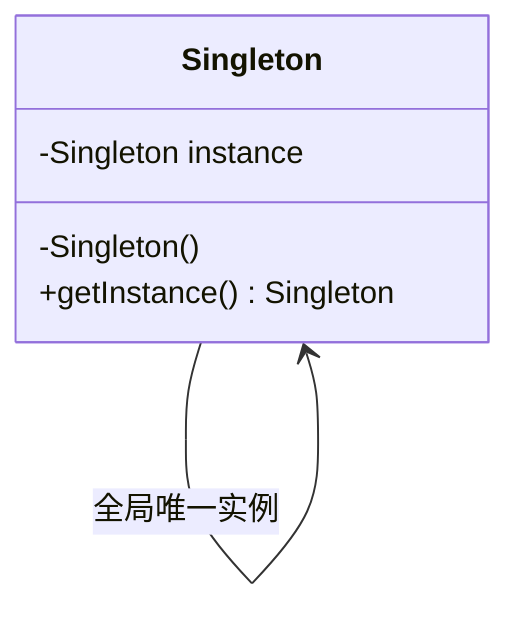

# 设计模式——单例模式

## 一、定义

> **单例模式**，也叫**单子模式**，是一种常用的软件设计模式，属于创建型模式的一种。在应用这个模式时，单例对象的类必须保证只有一个实例存在。许多时候整个系统只需要拥有一个的全局对象，这样有利于我们协调系统整体的行为。

比如在某个服务器程序中，该服务器的配置信息存放在一个文件中，这些配置数据由一个单例对象统一读取，然后服务进程中的其他对象再通过这个单例对象获取这些配置信息。又比如，Windows 中只能打开一个任务管理器，这样可以避免因打开多个任务管理器窗口而造成内存资源的浪费，或出现各个窗口显示内容的不一致等错误。

## 二、特点

- 单例类只有一个实例对象；
- 该单例对象必须由单例类自行创建；
- 单例类对外提供一个访问该单例的全局访问点。

## 三、优缺点

**单例模式的优点**：

- 单例模式可以保证内存里只有一个实例，减少了内存的开销。
- 可以避免对资源的多重占用。
- 单例模式设置全局访问点，可以优化和共享资源的访问。

**单例模式的缺点**：

- 单例模式一般没有接口，扩展困难。如果要扩展，则除了修改原来的代码，没有第二种途径，违背开闭原则。
- 在并发测试中，单例模式不利于代码调试。在调试过程中，如果单例中的代码没有执行完，也不能模拟生成一个新的对象。
- 单例模式的功能代码通常写在一个类中，如果功能设计不合理，则很容易违背单一职责原则。

## 四、应用场景

单例模式的应用场景主要有以下几个方面：

- 需要频繁创建的一些类，使用单例可以降低系统的内存压力，减少内存分配与回收的开销。
- 某类只要求生成一个对象的时候，如一个班中的班长、每个人的身份证号等。
- 某些类创建实例时占用资源较多，或实例化耗时较长，且经常使用。
- 某类需要频繁实例化，而创建的对象又频繁被销毁的时候，如多线程的线程池、网络连接池等。
- 频繁访问数据库或文件的对象。
- 对于一些控制硬件级别的操作，或者从系统上来讲应当是单一控制逻辑的操作，如果有多个实例，则系统会完全乱套。
- 当对象需要被共享的场合。由于单例模式只允许创建一个对象，共享该对象可以节省内存，并加快对象访问速度。如 Web 中的配置对象、数据库的连接池等。

## 五、实现思路

**实现单例模式的思路**：

- 一个类能返回对象一个引用(永远是同一个)和一个获得该实例的方法（必须是静态方法，通常使用 getInstance 这个名称）；
- 当我们调用这个方法时，如果类持有的引用不为空就返回这个引用，如果类保持的引用为空就创建该类的实例并将实例的引用赋予该类保持的引用；
- 同时我们还将该类的构造函数定义为私有方法，这样其他处的代码就无法通过调用该类的构造函数来实例化该类的对象，只有通过该类提供的静态方法来得到该类的唯一实例。

**UML** ：



**单例模式在多线程的应用场合下必须小心使用**：

如果当唯一实例尚未创建时，有两个线程同时调用创建方法，那么它们同时没有检测到唯一实例的存在，从而同时各自创建了一个实例，这样就有两个实例被构造出来，从而违反了单例模式中实例唯一的原则。 解决这个问题的办法是为指示类是否已经实例化的变量提供一个互斥锁(虽然这样会降低效率)。

## 六、单例模式的实现

单例模式通常有两种实现形式：**懒汉式单例**与**饿汉式单例**。

### 懒汉式单例

#### 1. 线程不安全的懒汉式

**特点**：因为没有加互斥锁，所以在多线程时不能正常工作。

```cpp
class NonThreadSafeLazy {
    /*
    * 线程不安全的懒汉式
    * */
public:
    static NonThreadSafeLazy* getInstance() {
        if (instance == nullptr) {
            instance = new NonThreadSafeLazy();
        }
        return instance;
    }

private:
    NonThreadSafeLazy() {
        // 避免在外部实例化
    }

    static NonThreadSafeLazy* instance;
};

NonThreadSafeLazy* NonThreadSafeLazy::instance = nullptr;
```

#### 2. 线程安全的懒汉式

**特点**：这种实现方式第一次调用才初始化实例，避免内存浪费；但是效率很低，因为这种加锁方式会影响效率。

```cpp
#include <mutex>

class ThreadSafeLazy {
    /*
    * 线程安全的懒汉式
    * */
public:
    static ThreadSafeLazy* getInstance() {
        // 进入方法即加互斥锁，为了保证线程安全
        std::lock_guard<std::mutex> lock(mtx);
        if (instance == nullptr) {
            instance = new ThreadSafeLazy();
        }
        return instance;
    }

private:
    ThreadSafeLazy() {}

    static ThreadSafeLazy* instance;  // 保证 instance 在所有线程中同步
    static std::mutex mtx;            // 互斥锁，对应 Java 的 synchronized
};

ThreadSafeLazy* ThreadSafeLazy::instance = nullptr;
std::mutex ThreadSafeLazy::mtx;
```

#### 3. 双检锁的懒汉式

**特点**：采用双检索（DCL，即 double-checked locking）模式，能够保证线程安全且在多线程情况下能保持高性能。

```cpp
#include <mutex>

class DCLLazy {
    /*
    * 采用双检锁（DCL，double-checked locking）实现的懒汉式
    * 注：Java 中的 volatile 用于禁止指令重排；C++ 的 volatile 没有
    * 线程同步语义，若不用互斥锁应改用 std::atomic，或直接采用 Meyers 单例
    * */
public:
    static DCLLazy* getInstance() {
        if (instance == nullptr) {                  // 第一次检查（无锁快速路径）
            std::lock_guard<std::mutex> lock(mtx);
            if (instance == nullptr)                // 第二次检查（防止重复创建）
                instance = new DCLLazy();
        }
        return instance;
    }

private:
    DCLLazy() {}

    static DCLLazy* instance;
    static std::mutex mtx;
};

DCLLazy* DCLLazy::instance = nullptr;
std::mutex DCLLazy::mtx;
```

#### 4. 局部静态变量的懒汉式（Meyers' Singleton，推荐）

C++11 标准规定：如果多个线程并发地首次进入初始化局部静态变量的语句，其中一个线程执行初始化，其余线程会等待其完成（俗称 Magic Statics）。因此在调用 getInstance() 的时候，才会对单例进行初始化（懒加载），且其初始化过程由编译器插入的锁保证线程安全，无需手写任何加锁代码。这也是 C++ 中最推荐的单例写法。

**特点**：兼顾了懒汉模式的内存优化（使用时才初始化）以及线程安全性（初始化由标准保证），再配合禁用拷贝，可彻底防止实例被破坏。

```cpp
class MeyersLazy {
    /*
    * 采用局部静态变量（Meyers' Singleton）实现的懒汉式
    * */
public:
    static MeyersLazy& getInstance() {
        // C++11 起，局部静态变量的初始化线程安全（Magic Statics）
        static MeyersLazy instance;
        return instance;
    }

    // 禁用拷贝与赋值，防止复制出多个实例
    MeyersLazy(const MeyersLazy&) = delete;
    MeyersLazy& operator=(const MeyersLazy&) = delete;

private:
    MeyersLazy() {}
};
```

### 饿汉式单例模式

#### 1. 饿汉式

**特点**：没有加锁，执行效率会提高；但是程序启动（静态初始化）时就创建实例，浪费内存。

```cpp
class Hungry {
    /*
    * 饿汉式单例模式
    * */
public:
    static Hungry& getInstance() {
        return instance;
    }

    Hungry(const Hungry&) = delete;
    Hungry& operator=(const Hungry&) = delete;

private:
    Hungry() {}

    static Hungry instance;  // 程序启动时（静态初始化阶段）即创建
};

Hungry Hungry::instance;
```

#### 2. 补充：禁用拷贝与赋值（C++ 防破坏单例）

**特点**：Java 中常用枚举实现单例，因为枚举默认线程安全，还能防止反射、反序列化破坏单例；C++ 没有枚举单例的惯用法，C++ 中破坏单例的途径是拷贝构造与赋值，因此通过 `= delete` 将它们禁用即可保证只有一个实例。

```cpp
class Singleton {
public:
    static Singleton& getInstance() {
        static Singleton instance;  // Meyers 单例，线程安全 + 懒加载
        return instance;
    }

    // 禁用拷贝构造与拷贝赋值：C++ 中防止单例被破坏的关键
    Singleton(const Singleton&) = delete;
    Singleton& operator=(const Singleton&) = delete;

private:
    Singleton() {}
};
```

******************

> 参考：
>
> - [菜鸟教程](https://www.runoob.com/design-pattern/singleton-pattern.html)
> - [C语言网](http://c.biancheng.net/view/1338.html)
> - https://refactoringguru.cn/

