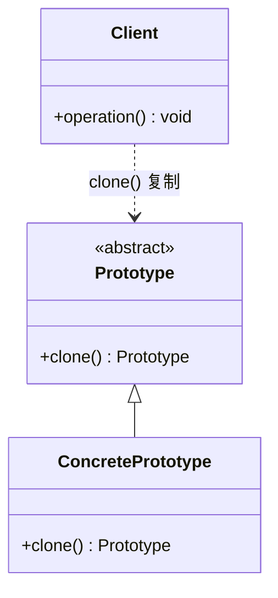

# 设计模式——原型模式

## 一、基本概念

### 1. 定义

> **原型模式**是创建型模式的一种，其特点在于通过“复制”一个已经存在的实例来返回新的实例,而不是新建实例。被复制的实例就是我们所称的“原型”，这个原型是可定制的。
>
> 原型模式多用于创建复杂的或者耗时的实例，因为这种情况下，复制一个已经存在的实例使程序运行更高效；或者创建值相等，只是命名不一样的同类数据。

### 2. 优缺点

**优点**：

- C++ 中原型模式基于拷贝构造函数复制对象，无需重新执行完整的构造初始化流程，在性能上往往更加优良；
- 可以使用深克隆方式保存对象的状态，使用原型模式将对象复制一份，并将其状态保存起来，简化了创建对象的过程，以便在需要的时候使用（例如恢复到历史某一状态），可辅助实现撤销操作。

**缺点**：

- 需要为每一个类都配置一个 clone 方法；
- clone 方法位于类的内部，当对已有类进行改造的时候，需要修改代码，违背了开闭原则；
- 当实现深克隆时，需要编写较为复杂的代码，而且当对象之间存在多重嵌套引用时，为了实现深克隆，每一层对象对应的类都必须支持深克隆，实现起来会比较麻烦。因此，深克隆、浅克隆需要运用得当。

### 3. 结构

原型模式包含以下主要角色。

- **抽象原型类**：规定了具体原型对象必须实现的接口；
- **具体原型类**：实现抽象原型类的 clone() 方法，它是可被复制的对象；
- **访问类**：使用具体原型类中的 clone() 方法来复制新的对象。

### 4. UML

C++ 中没有统一的根基类，惯用法是在抽象基类中声明虚函数 clone()，具体原型类利用拷贝构造函数实现它，这里的抽象基类就是抽象原型类。



## 二、代码实现

原型模式的克隆分为浅克隆和深克隆。

- **浅克隆**：创建一个新对象，新对象的属性和原来对象完全相同，对于指针类型的成员，仍指向原有属性所指向的内存地址；
- **深克隆**：创建一个新对象，属性中引用的其他对象也会被克隆，不再指向原有对象地址。

### 浅克隆

浅克隆使用拷贝构造函数实现即可。

```cpp
#include <iostream>
#include <vector>

class ConcretePrototype {
    /*
    * 具体原型类
    * */
public:
    // C++ 中利用拷贝构造函数实现克隆（对应 Java 的 clone()）
    ConcretePrototype* clone() const {
        return new ConcretePrototype(*this);
    }
};

int main() {
    /*
    * 实现类
    * */
    ConcretePrototype concretePrototype;
    std::vector<ConcretePrototype*> list;

    for (int i = 0; i < 10; i++) {
        list.push_back(concretePrototype.clone());
    }

    // 打印每个克隆对象的地址，可见是 10 个不同的新对象
    for (const auto* p : list) {
        std::cout << p << std::endl;
    }

    for (auto* p : list) {
        delete p;
    }
    return 0;
}
```

### 深克隆

深克隆一般情况下都是通过自定义拷贝构造函数实现（逐成员复制所引用的对象）。

```cpp
#include <iostream>
#include <string>

class Target {
    // 需要被深拷贝的类
public:
    std::string name;
    explicit Target(std::string name) : name(std::move(name)) {}
};

class ConPrototype {
    /*
    * C++ 中通过拷贝构造函数实现深克隆：
    * 成员 target 会被完整复制为新的对象，而非与原对象共享
    * */
private:
    Target target{"小红"};  // 等价于 Java 的 private Target target = new Target("小红");

public:
    ConPrototype* deepClone() const {
        // 调用拷贝构造函数，成员被逐层复制（深拷贝）
        return new ConPrototype(*this);
    }

    const Target& getTarget() const {
        return target;
    }
};

int main() {
    ConPrototype obj;
    ConPrototype* obj1 = obj.deepClone();
    // 比较：深克隆后两个 target 是不同的对象
    std::cout << std::boolalpha
              << (&obj.getTarget() == &obj1->getTarget()) << std::endl;
    delete obj1;
    return 0;
}
```

***

> 参考：
>
> - [菜鸟教程](https://www.runoob.com/design-pattern/singleton-pattern.html)
> - [C语言网](http://c.biancheng.net/view/1338.html)
> - [Refactoring.Guru](https://refactoringguru.cn/)
