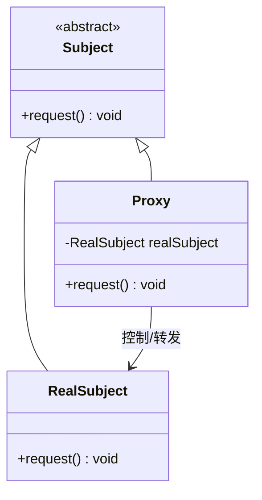

# 设计模式——代理模式

## 一、基本概念

### 1. 定义

> **代理模式**（英语：Proxy Pattern）是程序设计中的一种设计模式。
>
> 所谓的代理者是指一个类别可以作为其它东西的接口。代理者可以作任何东西的接口：网络连接、存储器中的大对象、文件或其它昂贵或无法复制的资源。

### 2. 优缺点

**优点**：

- 代理模式在客户端与目标对象之间起到一个中介作用和保护目标对象的作用；
- 代理对象可以扩展目标对象的功能；
- 代理模式能将客户端与目标对象分离，在一定程度上降低了系统的耦合度，增加了程序的可扩展性

**缺点**：

- 代理模式会造成系统设计中类的数量增加；
- 在客户端和目标对象之间增加一个代理对象，会造成请求处理速度变慢；
- 增加了系统的复杂度。

### 3. 结构

- **抽象主题（Subject）类**：通过接口或抽象类声明真实主题和代理对象实现的业务方法；
- **真实主题（Real Subject）类**：实现了抽象主题中的具体业务，是代理对象所代表的真实对象，是最终要引用的对象；
- **代理（Proxy）类**：提供了与真实主题相同的接口，其内部含有对真实主题的引用，它可以访问、控制或扩展真实主题的功能。



## 二、代码实现

### 抽象主题类

通过接口或抽象类声明真实主题和代理对象实现的业务方法：

```cpp
class Subject {
public:
    virtual ~Subject() = default;
    virtual void request() = 0;
};
```

### 真实主题类

实现了抽象主题中的具体业务，是代理对象所代表的真实对象，是最终要引用的对象：

```cpp
#include <iostream>

class RealSubject : public Subject {
public:
    void request() override {
        std::cout << "访问真实主题！" << std::endl;
    }
};
```

### 代理类

提供了与真实主题相同的接口，其内部含有对真实主题的引用，它可以访问、控制或扩展真实主题的功能：

```cpp
#include <iostream>
#include <memory>

class Proxy : public Subject {
public:
    void request() override {
        if (realSubject == nullptr) {
            realSubject = std::make_unique<RealSubject>();
        }
        preRequest();
        realSubject->request();
        postRequest();
    }

    void preRequest() {
        std::cout << "访问真实主题前的预处理..." << std::endl;
    }

    void postRequest() {
        std::cout << "访问真实主题后的处理..." << std::endl;
    }

private:
    std::unique_ptr<RealSubject> realSubject;  // 延迟创建的真实主题指针
};
```

### 客户类

```cpp
int main() {
    Proxy proxy;
    proxy.request();
}
```

运行结果：

```
访问真实主题前的预处理...
访问真实主题！
访问真实主题后的处理...
```

***

> 参考：
>
> - [菜鸟教程](https://www.runoob.com/design-pattern/singleton-pattern.html)
> - [C语言网](http://c.biancheng.net/view/1338.html)
> - [Refactoring.Guru](https://refactoringguru.cn/)