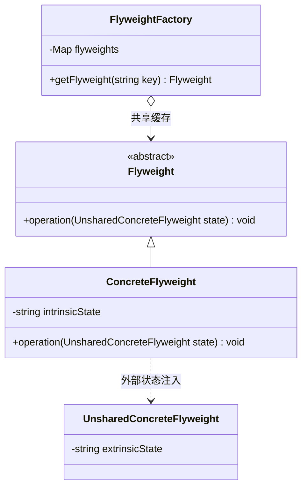

# 设计模式——享元模式

## 一、基本概念

### 1. 定义

> **享元模式**（英语：Flyweight Pattern）是一种软件设计模式。它使用物件用来尽可能减少内存使用量；于相似物件中分享尽可能多的资讯。当大量物件近乎重复方式存在，因而使用大量内存时，此法适用。通常物件中的部分状态(state)能够共享。常见做法是把它们放在数据结构外部，当需要使用时再将它们传递给享元。

### 2. 优缺点

**优点**：

- 相同对象只要保存一份，这降低了系统中对象的数量，从而降低了系统中细粒度对象给内存带来的压力。

**缺点**：

- 为了使对象可以共享，需要将一些不能共享的状态外部化，这将增加程序的复杂性；
- 读取享元模式的外部状态会使得运行时间稍微变长。

### 3. 结构

- **抽象享元（Flyweight）角色**：是所有的具体享元类的基类，为具体享元规范需要实现的公共接口，非享元的外部状态以参数的形式通过方法传入；
- **具体享元（Concrete Flyweight）角色**：实现抽象享元角色中所规定的接口；
- **非享元（Unsharable Flyweight）角色**：是不可以共享的外部状态，它以参数的形式注入具体享元的相关方法中；
- **享元工厂（Flyweight Factory）角色**：负责创建和管理享元角色。当客户对象请求一个享元对象时，享元工厂检査系统中是否存在符合要求的享元对象，如果存在则提供给客户；如果不存在的话，则创建一个新的享元对象。



## 二、代码实现

### 非享元角色

抽象享元角色是不可以共享的外部状态，它以参数的形式注入具体享元的相关方法中：

```cpp
#include <string>

class UnsharedConcreteFlyweight {
public:
    explicit UnsharedConcreteFlyweight(std::string info) : info(std::move(info)) {}

    std::string getInfo() const {
        return info;
    }

    void setInfo(std::string info) {
        this->info = std::move(info);
    }

private:
    std::string info;
};
```

### 抽象享元角色

抽象享元角色是所有的具体享元类的基类，为具体享元规范需要实现的公共接口，非享元的外部状态以参数的形式通过方法传入：

```cpp
class Flyweight {
public:
    virtual ~Flyweight() = default;
    virtual void operation(const UnsharedConcreteFlyweight& state) = 0;
};
```

### 具体享元角色

具体享元角色实现抽象享元角色中所规定的接口：

```cpp
#include <iostream>
#include <string>

class ConcreteFlyweight : public Flyweight {
public:
    explicit ConcreteFlyweight(const std::string& key) : key(key) {
        std::cout << "具体享元" << key << "被创建！" << std::endl;
    }

    void operation(const UnsharedConcreteFlyweight& state) override {
        std::cout << "具体享元" << key << "被调用，";
        std::cout << "非享元信息是:" << state.getInfo() << std::endl;
    }

private:
    std::string key;
};
```

### 享元工厂角色

享元工厂角色负责创建和管理享元角色。当客户对象请求一个享元对象时，享元工厂检査系统中是否存在符合要求的享元对象，如果存在则提供给客户；如果不存在的话，则创建一个新的享元对象：

```cpp
#include <iostream>
#include <memory>
#include <string>
#include <unordered_map>

class FlyweightFactory {
public:
    Flyweight* getFlyweight(const std::string& key) {
        Flyweight* flyweight = nullptr;
        auto it = flyweightHashMap.find(key);
        if (it != flyweightHashMap.end()) {
            flyweight = it->second.get();
            std::cout << "具体享元" << key << "已经存在，被成功获取！" << std::endl;
        } else {
            auto concrete = std::make_unique<ConcreteFlyweight>(key);
            flyweight = concrete.get();
            flyweightHashMap.emplace(key, std::move(concrete));
        }
        return flyweight;
    }

private:
    std::unordered_map<std::string, std::unique_ptr<Flyweight>> flyweightHashMap;
};
```

### 客户类

```cpp
int main() {
    FlyweightFactory factory;
    Flyweight* f01 = factory.getFlyweight("a");
    Flyweight* f02 = factory.getFlyweight("a");
    Flyweight* f11 = factory.getFlyweight("b");
    Flyweight* f12 = factory.getFlyweight("b");

    f01->operation(UnsharedConcreteFlyweight("第1次调用a。"));
    f02->operation(UnsharedConcreteFlyweight("第2次调用a。"));
    f11->operation(UnsharedConcreteFlyweight("第1次调用b。"));
    f12->operation(UnsharedConcreteFlyweight("第2次调用b。"));
}
```

运行结果：

```
具体享元a被创建！
具体享元a已经存在，被成功获取！
具体享元b被创建！
具体享元b已经存在，被成功获取！
具体享元a被调用，非享元信息是:第1次调用a。
具体享元a被调用，非享元信息是:第2次调用a。
具体享元b被调用，非享元信息是:第1次调用b。
具体享元b被调用，非享元信息是:第2次调用b。
```

***

> 参考：
>
> - [菜鸟教程](https://www.runoob.com/design-pattern/singleton-pattern.html)
> - [C语言网](http://c.biancheng.net/view/1338.html)
> - [Refactoring.Guru](https://refactoringguru.cn/)