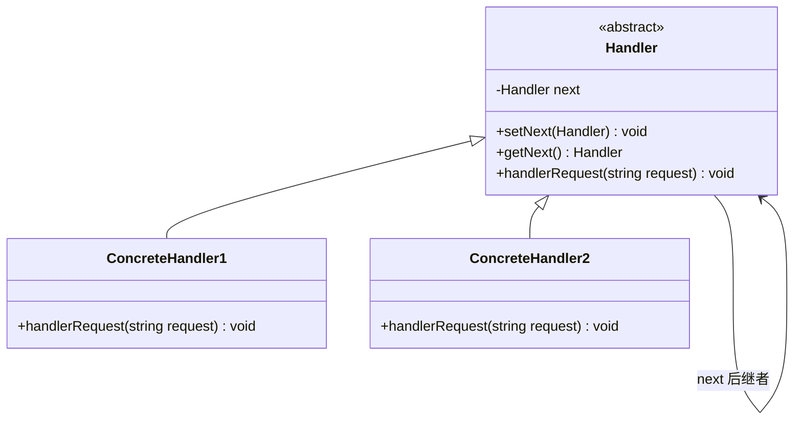

# 设计模式——责任链模式

## 一、基本概念

### 1. 定义

> **责任链模式（Chain of Responsibility）：**在面向对象程式设计里是一种软件设计模式，它包含了一些命令对象和一系列的处理对象。每一个处理对象决定它能处理哪些命令对象，它也知道如何将它不能处理的命令对象传递给该链中的下一个处理对象。该模式还描述了往该处理链的末尾添加新的处理对象的方法。

### 2. 优缺点

**优点**：

- 降低了对象之间的耦合度。该模式使得一个对象无须知道到底是哪一个对象处理其请求以及链的结构，发送者和接收者也无须拥有对方的明确信息；
- 增强了系统的可扩展性。可以根据需要增加新的请求处理类，满足开闭原则；
- 增强了给对象指派职责的灵活性。当工作流程发生变化，可以动态地改变链内的成员或者调动它们的次序，也可动态地新增或者删除责任；
- 责任链简化了对象之间的连接。每个对象只需保持一个指向其后继者的引用，不需保持其他所有处理者的引用，这避免了使用众多的 if 或者 if···else 语句；
- 责任分担。每个类只需要处理自己该处理的工作，不该处理的传递给下一个对象完成，明确各类的责任范围，符合类的单一职责原则。

**缺点**：

- 不能保证每个请求一定被处理。由于一个请求没有明确的接收者，所以不能保证它一定会被处理，该请求可能一直传到链的末端都得不到处理；
- 对比较长的职责链，请求的处理可能涉及多个处理对象，系统性能将受到一定影响；
- 职责链建立的合理性要靠客户端来保证，增加了客户端的复杂性，可能会由于职责链的错误设置而导致系统出错，如可能会造成循环调用。

### 3. 结构

- **抽象处理者（Handler）角色**：定义一个处理请求的接口，包含抽象处理方法和一个后继连接；
- **具体处理者（Concrete Handler）角色**：实现抽象处理者的处理方法，判断能否处理本次请求，如果可以处理请求则处理，否则将该请求转给它的后继者；
- **客户类（Client）角色**：创建处理链，并向链头的具体处理者对象提交请求，它不关心处理细节和请求的传递过程。



## 二、代码实现

### 抽象处理者角色

定义一个处理请求的接口，包含抽象处理方法和一个后继连接：

```cpp
#include <string>

class Handler {
public:
    virtual ~Handler() = default;

    void setNext(Handler* next) {
        this->next = next;
    }

    Handler* getNext() const {
        return next;
    }

    virtual void handlerRequest(const std::string& request) = 0;

private:
    Handler* next = nullptr;
};
```

### 具体处理者角色

实现抽象处理者的处理方法，判断能否处理本次请求，如果可以处理请求则处理，否则将该请求转给它的后继者：

**处理者1**：

```cpp
#include <iostream>
#include <string>

class ConcreteHandler1 : public Handler {
public:
    void handlerRequest(const std::string& request) override {
        std::string newRequest = request + " - 处理者1 已处理";
        std::cout << "处理者1 已经处理该请求!" << std::endl;
        if (getNext() != nullptr) {
            getNext()->handlerRequest(newRequest);
        } else {
            std::cout << "无人处理该请求!" << std::endl;
        }
    }
};
```

**处理者2**：

```cpp
#include <iostream>
#include <string>

class ConcreteHandler2 : public Handler {
public:
    void handlerRequest(const std::string& request) override {
        std::string newRequest = request + "- 处理者2 已处理 ";
        std::cout << "处理者2 已经处理该请求!" << std::endl;
        if (getNext() != nullptr) {
            getNext()->handlerRequest(newRequest);
        } else {
            std::cout << "请求处理完毕!" << std::endl;
            std::cout << "最终处理结果：" << newRequest << std::endl;
        }
    }
};
```

### 客户类

```cpp
#include <memory>

int main() {
    std::unique_ptr<Handler> handler1 = std::make_unique<ConcreteHandler1>();
    std::unique_ptr<Handler> handler2 = std::make_unique<ConcreteHandler2>();

    handler1->setNext(handler2.get());
    handler1->handlerRequest("Hello World!");
    return 0;
}
```

运行结果：

```
处理者1 已经处理该请求!
处理者2 已经处理该请求!
请求处理完毕!
最终处理结果：Hello World! - 处理者1 已处理- 处理者2 已处理
```

***

> 参考：
>
> - [菜鸟教程](https://www.runoob.com/design-pattern/singleton-pattern.html)
> - [C语言网](http://c.biancheng.net/view/1338.html)
> - [Refactoring.Guru](https://refactoringguru.cn/)

