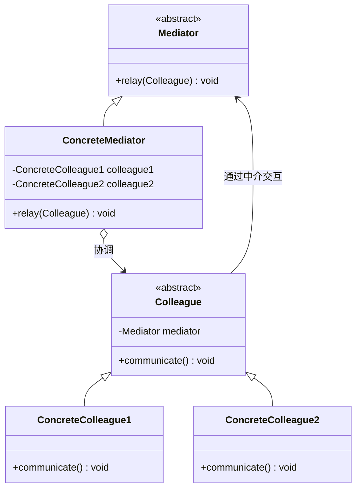

# 设计模式——中介者模式

## 一、基本概念

### 1. 定义

> **中介者（Mediator）模式**：定义一个中介对象来封装一系列对象之间的交互，使原有对象之间的耦合松散，且可以独立地改变它们之间的交互。中介者模式又叫调停模式，它是迪米特法则的典型应用。

### 2. 优缺点

**优点**：

- 类之间各司其职，符合迪米特法则；
- 降低了对象之间的耦合性，使得对象易于独立地被复用；
- 将对象间的一对多关联转变为一对一的关联，提高系统的灵活性，使得系统易于维护和扩展。

**缺点**：

- 中介者模式将原本多个对象直接的相互依赖变成了中介者和多个同事类的依赖关系。当同事类越多时，中介者就会越臃肿，变得复杂且难以维护。

### 3. 结构

- **抽象中介者（Mediator）角色**：它是中介者的接口，提供了同事对象注册与转发同事对象信息的抽象方法；
- **具体中介者（Concrete Mediator）角色**：实现中介者接口，定义一个容器来管理同事对象，协调各个同事角色之间的交互关系，因此它依赖于同事角色；
- **抽象同事类（Colleague）角色**：定义同事类的接口，保存中介者对象，提供同事对象交互的抽象方法，实现所有相互影响的同事类的公共功能；
- **具体同事类（Concrete Colleague）角色**：是抽象同事类的实现者，当需要与其他同事对象交互时，由中介者对象负责后续的交互。



## 二、代码实现

### 抽象同事类

定义同事类的接口，保存中介者对象，提供同事对象交互的抽象方法，实现所有相互影响的同事类的公共功能：

```cpp
class Mediator;  // 前向声明

class Colleague {
public:
    virtual ~Colleague() = default;

    void setMediator(Mediator* mediator) {
        this->mediator = mediator;
    }

    virtual void receive() = 0;
    virtual void send() = 0;

protected:
    Mediator* mediator = nullptr;
};
```

### 具体同事类

是抽象同事类的实现者，当需要与其他同事对象交互时，由中介者对象负责后续的交互：

```cpp
#include <iostream>

class ConcreteColleague1 : public Colleague {
public:
    void receive() override {
        std::cout << "具体同事1收到请求..." << std::endl;
    }

    void send() override {
        std::cout << "同事1发出请求..." << std::endl;
        mediator->relay(this);
    }
};
```

```cpp
#include <iostream>

class ConcreteColleague2 : public Colleague {
public:
    void receive() override {
        std::cout << "具体同事2收到请求..." << std::endl;
    }

    void send() override {
        std::cout << "同事2发出请求..." << std::endl;
        mediator->relay(this);
    }
};
```

### 抽象中介者

它是中介者的接口，提供了同事对象注册与转发同事对象信息的抽象方法：

```cpp
class Mediator {
public:
    virtual ~Mediator() = default;
    virtual void registerColleague(Colleague* colleague) = 0;
    virtual void relay(Colleague* colleague) = 0;
};
```

### 具体中介者

实现中介者接口，定义一个容器来管理同事对象，协调各个同事角色之间的交互关系，因此它依赖于同事角色：

```cpp
#include <algorithm>
#include <vector>

class ConcreteMediator : public Mediator {
public:
    void registerColleague(Colleague* colleague) override {
        if (std::find(colleagues.begin(), colleagues.end(), colleague) == colleagues.end()) {
            colleagues.push_back(colleague);
            colleague->setMediator(this);
        }
    }

    void relay(Colleague* colleague) override {
        for (Colleague* obj : colleagues) {
            if (obj != colleague) {
                obj->receive();
            }
        }
    }

private:
    std::vector<Colleague*> colleagues;
};
```

### 客户类

```cpp
#include <memory>

int main() {
    std::unique_ptr<Mediator> mediator = std::make_unique<ConcreteMediator>();
    std::unique_ptr<Colleague> c1 = std::make_unique<ConcreteColleague1>();
    std::unique_ptr<Colleague> c2 = std::make_unique<ConcreteColleague2>();

    mediator->registerColleague(c1.get());
    mediator->registerColleague(c2.get());
    c1->send();
    c2->send();
}
```

运行结果：

```
同事1发出请求...
具体同事2收到请求...
同事2发出请求...
具体同事1收到请求...
```

***

> 参考：
>
> - [菜鸟教程](https://www.runoob.com/design-pattern/singleton-pattern.html)
> - [C语言网](http://c.biancheng.net/view/1338.html)
> - [Refactoring.Guru](https://refactoringguru.cn/)