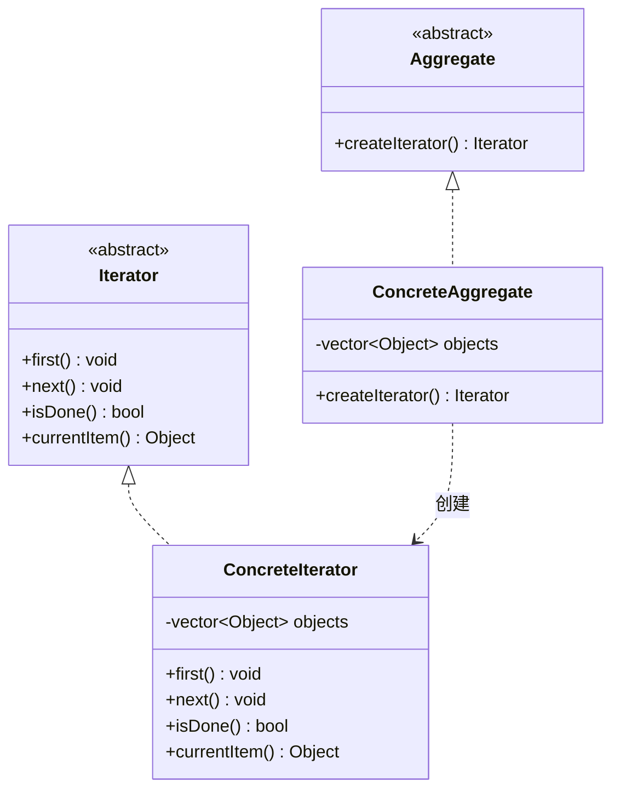

# 设计模式——迭代器模式

## 一、基本概念

### 1. 定义

> **迭代器模式（Iterator）**：是一种最简单也最常见的设计模式。它可以让用户透过特定的接口巡访容器中的每一个元素而不用了解底层的实现。

### 2. 优缺点

**优点**：

- 访问一个聚合对象的内容而无须暴露它的内部表示；
- 遍历任务交由迭代器完成，这简化了聚合类；
- 它支持以不同方式遍历一个聚合，甚至可以自定义迭代器的子类以支持新的遍历；
- 增加新的聚合类和迭代器类都很方便，无须修改原有代码；
- 封装性良好，为遍历不同的聚合结构提供一个统一的接口。

**缺点**：

- 增加了类的个数，这在一定程度上增加了系统的复杂性。

### 3. 结构

- **抽象聚合（Aggregate）角色**：定义存储、添加、删除聚合对象以及创建迭代器对象的接口；
- **具体聚合（ConcreteAggregate）角色**：实现抽象聚合类，返回一个具体迭代器的实例；
- **抽象迭代器（Iterator）角色**：定义访问和遍历聚合元素的接口，通常包含 hasNext()、first()、next() 等方法；
- **具体迭代器（Concretelterator）角色**：实现抽象迭代器接口中所定义的方法，完成对聚合对象的遍历，记录遍历的当前位置。



## 二、代码实现

### 抽象迭代器

定义访问和遍历聚合元素的接口，通常包含 hasNext()、first()、next() 等方法：

```cpp
#include <string>

class Iterator {
public:
    virtual ~Iterator() = default;
    virtual std::string first() = 0;
    virtual std::string next() = 0;
    virtual bool hasNext() const = 0;
};
```

### 具体迭代器

实现抽象迭代器接口中所定义的方法，完成对聚合对象的遍历，记录遍历的当前位置：

```cpp
#include <string>
#include <vector>

class ConcreteIterator : public Iterator {
public:
    ConcreteIterator(std::vector<std::string>& list)
        : list(list), index(-1) {}

    std::string first() override {
        index = 0;
        return list[index];
    }

    std::string next() override {
        if (hasNext()) {
            return list[++index];
        }
        return "";
    }

    bool hasNext() const override {
        return index < static_cast<int>(list.size()) - 1;
    }

private:
    std::vector<std::string>& list;
    int index;
};
```

### 抽象聚合

定义存储、添加、删除聚合对象以及创建迭代器对象的接口：

```cpp
#include <memory>
#include <string>

class Iterator;

class Aggregate {
public:
    virtual ~Aggregate() = default;
    virtual void add(const std::string& obj) = 0;
    virtual void remove(const std::string& obj) = 0;
    virtual std::unique_ptr<Iterator> getIterator() = 0;
};
```

### 具体聚合

实现抽象聚合类，返回一个具体迭代器的实例：

```cpp
#include <algorithm>
#include <memory>
#include <string>
#include <vector>

class ConcreteAggregate : public Aggregate {
public:
    void add(const std::string& obj) override {
        list.push_back(obj);
    }

    void remove(const std::string& obj) override {
        auto it = std::find(list.begin(), list.end(), obj);
        if (it != list.end()) {
            list.erase(it);
        }
    }

    std::unique_ptr<Iterator> getIterator() override {
        return std::make_unique<ConcreteIterator>(list);
    }

private:
    std::vector<std::string> list;
};
```

### 客户类

```cpp
#include <iostream>
#include <memory>
#include <string>

int main() {
    std::unique_ptr<Aggregate> aggregate = std::make_unique<ConcreteAggregate>();
    aggregate->add("西瓜");
    aggregate->add("橘子");
    aggregate->add("苹果");
    aggregate->add("草莓");

    std::cout << "遍历集合：" << std::endl;
    std::unique_ptr<Iterator> iterator = aggregate->getIterator();
    while (iterator->hasNext()) {
        std::string obj = iterator->next();
        std::cout << obj << "\t";
    }
    std::string obj = iterator->first();
    std::cout << "\nFirst: " << obj << std::endl;
    return 0;
}
```

运行结果：

```
遍历集合：
西瓜	橘子	苹果	草莓	
First: 西瓜
```

***

> 参考：
>
> - [菜鸟教程](https://www.runoob.com/design-pattern/singleton-pattern.html)
> - [C语言网](http://c.biancheng.net/view/1338.html)
> - [Refactoring.Guru](https://refactoringguru.cn/)

