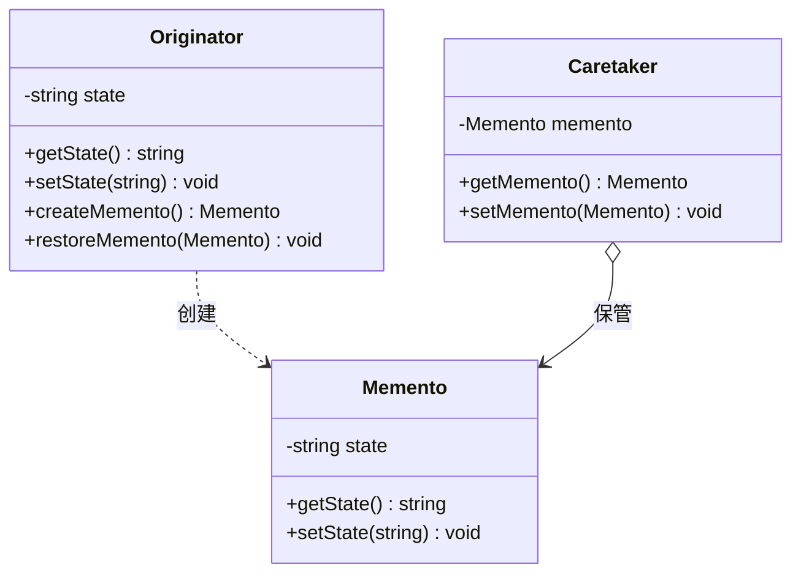

# 设计模式——备忘录模式

title: 设计模式——备忘录模式
description: demo示例
pubDate: 2026-1-19
image: "/image/be0cf6.jpeg"
categories:

  - text

  - cpp

  tags:

  - Markdown

  - 设计模式

  - 博客

## 一、基本概念

### 1. 定义

> **备忘录（Memento）模式**：在不破坏封装性的前提下，捕获一个对象的内部状态，并在该对象之外保存这个状态，以便以后当需要时能将该对象恢复到原先保存的状态。该模式又叫快照模式。

### 2. 优缺点

**优点**：

- 提供了一种可以恢复状态的机制。当用户需要时能够比较方便地将数据恢复到某个历史的状态；
- 实现了内部状态的封装。除了创建它的发起人之外，其他对象都不能够访问这些状态信息；
- 简化了发起人类。发起人不需要管理和保存其内部状态的各个备份，所有状态信息都保存在备忘录中，并由管理者进行管理，这符合单一职责原则。

**缺点**：

- 资源消耗大。如果要保存的内部状态信息过多或者特别频繁，将会占用比较大的内存资源。

### 3. 结构

- **发起人（Originator）角色**：记录当前时刻的内部状态信息，提供创建备忘录和恢复备忘录数据的功能，实现其他业务功能，它可以访问备忘录里的所有信息；
- **备忘录（Memento）角色**：负责存储发起人的内部状态，在需要的时候提供这些内部状态给发起人；
- **管理者（Caretaker）角色**：对备忘录进行管理，提供保存与获取备忘录的功能，但其不能对备忘录的内容进行访问与修改。



## 二、代码实现

### 备忘录

负责存储发起人的内部状态，在需要的时候提供这些内部状态给发起人：

```cpp
#include <string>

class Memento {
public:
    Memento(const std::string& state) : state(state) {}

    void setState(const std::string& state) {
        this->state = state;
    }

    std::string getState() const {
        return state;
    }

private:
    std::string state;
};
```

### 发起人

记录当前时刻的内部状态信息，提供创建备忘录和恢复备忘录数据的功能，实现其他业务功能：

```cpp
#include <string>

class Originator {
public:
    void setState(const std::string& state) {
        this->state = state;
    }

    std::string getState() const {
        return state;
    }

    Memento createMemento() {
        return Memento(state);
    }

    void restoreMemento(const Memento& memento) {
        setState(memento.getState());
    }

private:
    std::string state;
};
```

### 管理者

对备忘录进行管理，提供保存与获取备忘录的功能，但其不能对备忘录的内容进行访问与修改：

```cpp
class Caretaker {
public:
    void setMemento(const Memento& memento) {
        this->memento = memento;
    }

    const Memento& getMemento() const {
        return memento;
    }

private:
    Memento memento{""};
};
```

### 客户类

```cpp
#include <iostream>
#include <string>

int main() {
    Originator originator;
    Caretaker caretaker;
    originator.setState("S0");
    std::cout << "初始状态: " << originator.getState() << std::endl;
    caretaker.setMemento(originator.createMemento());
    originator.setState("S1");
    std::cout << "新的状态: " << originator.getState() << std::endl;
    originator.restoreMemento(caretaker.getMemento());
    std::cout << "恢复状态: " << originator.getState() << std::endl;
    return 0;
}
```

运行结果：

```
初始状态: S0
新的状态: S1
恢复状态: S0
```

***

> 参考：
>
> - [菜鸟教程](https://www.runoob.com/design-pattern/singleton-pattern.html)
> - [C语言网](http://c.biancheng.net/view/1338.html)
> - [Refactoring.Guru](https://refactoringguru.cn/)